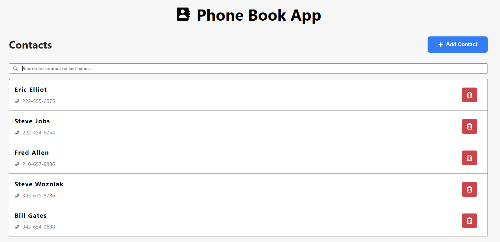
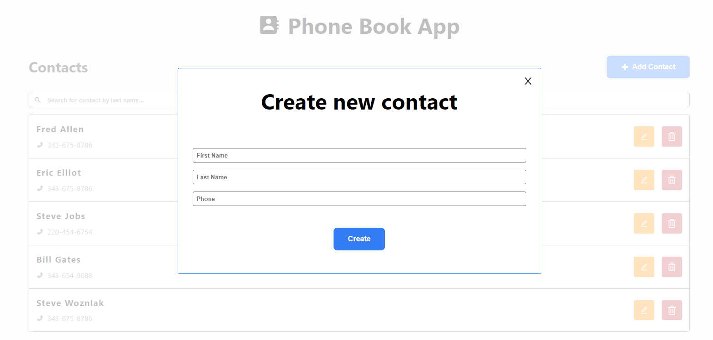
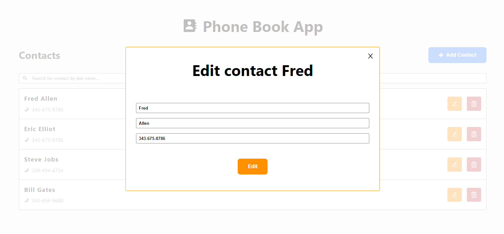
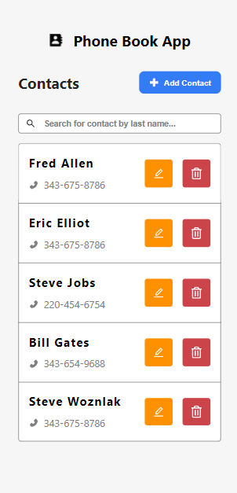

# Phone Book

## Installation (using NodeJs 18.x + npm)

- Frontend
  - Run `npm i` inside *frontend* folder
  - And run `npm run dev` to start React with Vite app
  - The app will render in `http://localhost:5173/`
- Backend
  - Run `npm i` inside *backend* folder
  - And run `npm run start` to start NestJs (NodeJs) app
  - The app will run in `http://localhost:3000/`

## Prints






## Frontend

- Pages/components
  - Home
  - ContactItem
  - CreateContactModal
  - EditContactModal
- Services
  - httpService
  - contactService
- Models
  - ContactInterface
  - ModalInterface
  - EditModalInterface

## Backend

- Entities

```typescript
Contact {
  id: number;
  firstName: string;
  lastName: string;
  phone: string;
}
```

- Routes

> GET - List contacts - **/contact**

> POST - Create contact - **/contact**

> UPDATE - Update one contact - **/contact/:id**

> DELETE - Delete one contact - **/contact/:id**

## Technologies

- Frontend: React + Vite (typescript)
- Backend: NestJs (NodeJs) + Prisma (SQLite)

## Author

Henrique - henrique.rodrigues7@hotmail.com

Website - https://henriquerod.com/
